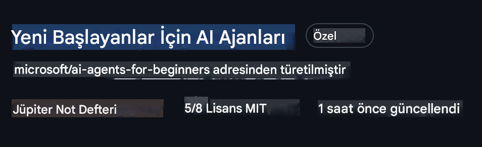
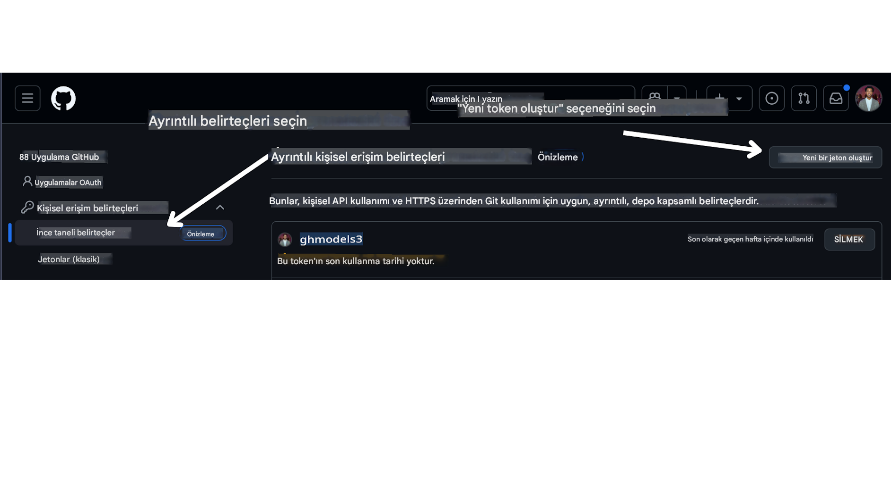

# Kurs Kurulumu

## Giriş

Bu derste, kurs boyunca kullanacağımız kod örneklerinin nasıl çalıştırılacağını öğreneceğiz.

## Gereksinimler

- GitHub Hesabı
- Python 3.12 veya üzeri
- Azure Aboneliği
- Azure AI Foundry Hesabı

## Depoyu Klonlayın veya Çatallayın

Başlamak için GitHub deposunu klonlamanız veya çatallamanız gerekiyor. Bu sayede kurs materyallerinin kendi versiyonunuza sahip olacak ve kodları çalıştırıp test edebileceksiniz.

Bunu yapmak için <a href="https://github.com/microsoft/ai-agents-for-beginners/fork" target="_blank">depoyu çatallama</a> bağlantısına tıklayabilirsiniz.

İşlem tamamlandığında, kursun kendi çatallanmış versiyonunuza aşağıdaki bağlantıdan ulaşabilirsiniz:



## GitHub Kişisel Erişim Token'ınızı (PAT) Alın

Bu kurs, AI Ajanları oluşturmak için kullanacağımız Büyük Dil Modellerine (LLM) ücretsiz erişim sağlamak amacıyla GitHub Modeller Pazarını kullanıyor.

Bu hizmete erişebilmek için bir GitHub Kişisel Erişim Token'ı oluşturmanız gerekiyor.

Bunun için GitHub hesabınızdaki <a href="https://github.com/settings/personal-access-tokens" target="_blank">Kişisel Erişim Token'ları ayarlarına</a> gidin.

Sol taraftaki `Fine-grained tokens` seçeneğini seçin.

Ardından `Generate new token` seçeneğine tıklayın.



Oluşturduğunuz token'ı kopyalayın. Bu token'ı daha sonra kurs içinde bulunan `.env` dosyasına ekleyeceğiz.

## Ortam Değişkenlerini Ayarlayın

`.env` dosyasını oluşturmak için terminalinizde aşağıdaki komutu çalıştırın:

```bash
cp .env.example .env
```

Bu komut, örnek dosyayı kopyalayarak dizininizde bir `.env` dosyası oluşturacaktır. Ortam değişkenlerinin değerlerini [Azure AI Foundry](https://ai.azure.com?WT.mc_id=academic-105485-koreyst) portalından alabilirsiniz:

Oluşturduğunuz token'ı `.env` dosyasındaki `GITHUB_TOKEN=` alanına yapıştırın.
- `AZURE_SUBSCRIPTION_ID` - Projenizin **Genel Bakış** sayfasındaki **Proje detayları** bölümünde
- `AZURE_AI_PROJECT_NAME` - Projenizin **Genel Bakış** sayfasının en üstünde
- `AZURE_OPENAI_RESOURCE_GROUP` - **Yönetim Merkezi** içindeki **Genel Bakış** sayfasında **Proje özellikleri** bölümünde
- `AZURE_OPENAI_SERVICE` - Projenizin **Genel Bakış** sayfasında **Dahil edilen yetenekler** sekmesinde **Azure OpenAI Service** altında
- `AZURE_OPENAI_API_VERSION` - [API sürüm yaşam döngüsü](https://learn.microsoft.com/azure/ai-services/openai/api-version-deprecation#latest-ga-api-release?WT.mc_id=academic-105485-koreyst) sayfasında **En son GA API sürümü** bölümünde
- `AZURE_OPENAI_ENDPOINT` - Model dağıtımınızın **Detaylar** sekmesinde **Endpoint** (yani **Hedef URI**) bölümünde

## Gerekli Paketleri Yükleyin

Kodları çalıştırabilmek için gerekli Python paketlerini yüklemeniz gerekiyor.

Paket çakışmalarını ve sorunları önlemek için bir Python sanal ortamı oluşturmanızı öneriyoruz.

```bash
pip install -r requirements.txt
```

Bu komut, gerekli tüm Python paketlerini yükleyecektir.

# Azure'da Oturum Açın

Güvenlik açısından en iyi yöntem olarak, Azure OpenAI'ye Microsoft Entra ID ile bağlanmak için anahtarsız kimlik doğrulama kullanacağız. Bunun için öncelikle işletim sisteminize uygun [Azure CLI'yi](https://learn.microsoft.com/cli/azure/install-azure-cli?WT.mc_id=academic-105485-koreyst) yüklemeniz gerekiyor.

Ardından terminali açıp Azure hesabınızda oturum açmak için `az login` komutunu çalıştırın.

## Azure'da Oturum Açın

Azure kaynaklarını kullanabilmek için Azure AI hesabınızla giriş yapın.

Yeni bir terminal açın ve aşağıdaki komutu çalıştırın, ardından terminaldeki talimatları takip edin:

`az login --use-device-code`

Giriş yaptıktan sonra terminal üzerinden aboneliğinizi seçin.

## Ortam Değişkenlerine Erişim

Ortam değişkenlerine erişebilmek için `os` ve `load_dotenv` modüllerini içe aktaracağız.

```python
import os
from dotenv import load_dotenv

load_dotenv()
```

## Anahtarsız Kimlik Doğrulamayı Ayarlayın

Kimlik bilgilerinizi kod içinde saklamak yerine, Azure OpenAI ile anahtarsız bağlantı kullanacağız. Bunun için `DefaultAzureCredential` modülünü içe aktaracağız ve kimlik bilgilerini almak için `DefaultAzureCredential` fonksiyonunu kullanacağız.

```python
from azure.identity import DefaultAzureCredential, InteractiveBrowserCredential
```

Artık kurs kodlarını çalıştırmaya hazırsınız! AI Ajanları dünyasını keşfetmek için iyi çalışmalar!

Kurulum sırasında herhangi bir sorunla karşılaşırsanız, <a href="https://discord.gg/kzRShWzttr" target="_blank">Azure AI Topluluğu Discord</a>'umuza katılabilir veya <a href="https://github.com/microsoft/ai-agents-for-beginners/issues?WT.mc_id=academic-105485-koreyst" target="_blank">bir sorun oluşturabilirsiniz</a>.

## Sonraki Ders

[AI Ajanlarına Giriş ve Ajan Kullanım Senaryoları](../01-intro-to-ai-agents/README.md)
