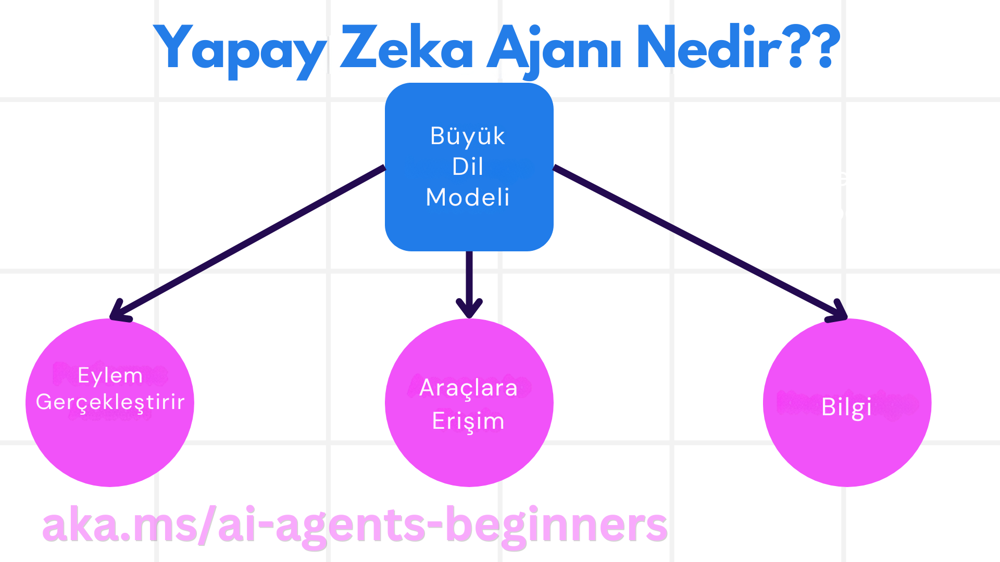
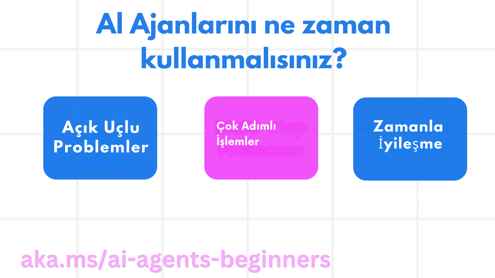

> _(Dersi izlemek için yukarıdaki görsele tıklayın)_

# AI Ajanlarına Giriş ve Ajan Kullanım Senaryoları

"AI Ajanlarına Başlangıç" kursuna hoş geldiniz! Bu kurs, AI Ajanları oluşturmak için temel bilgiler ve uygulamalı örnekler sunmaktadır.

Diğer öğrenciler ve AI Ajan geliştiricileriyle tanışmak ve kurs hakkında sorularınızı sormak için <a href="https://discord.gg/kzRShWzttr" target="_blank">Azure AI Discord Topluluğu</a>'na katılabilirsiniz.

Kursa başlarken, öncelikle AI Ajanlarının ne olduğunu ve oluşturduğumuz uygulamalarda ve iş akışlarında nasıl kullanabileceğimizi daha iyi anlayacağız.

## Giriş

Bu derste şunları öğreneceksiniz:

- AI Ajanları nedir ve farklı ajan türleri nelerdir?
- AI Ajanları hangi kullanım senaryoları için en uygundur ve bize nasıl yardımcı olabilirler?
- Ajanik Çözümler tasarlarken kullanılan temel yapı taşları nelerdir?

## Öğrenme Hedefleri
Bu dersi tamamladıktan sonra şunları yapabileceksiniz:

- AI Ajan kavramlarını ve diğer AI çözümlerinden farklarını anlamak
- AI Ajanlarını en verimli şekilde uygulamak
- Hem kullanıcılar hem de müşteriler için verimli Ajanik çözümler tasarlamak

## AI Ajanlarının Tanımı ve Türleri

### AI Ajanları Nedir?

AI Ajanları, **Büyük Dil Modellerinin (LLM)** yeteneklerini genişleterek **yardımcı araçlara** ve **bilgiye** erişim sağlayarak **eylemler gerçekleştirmesini** sağlayan **sistemlerdir**.

Bu tanımı daha küçük parçalara ayıralım:

- **Sistem** - Ajanları tek bir bileşen olarak değil, birçok bileşenden oluşan bir sistem olarak düşünmek önemlidir. Temel düzeyde, bir AI Ajanının bileşenleri şunlardır:
  - **Ortam** - AI Ajanının çalıştığı tanımlı alan. Örneğin, bir seyahat rezervasyon AI Ajanımız olsaydı, ortam, AI Ajanının görevleri tamamlamak için kullandığı seyahat rezervasyon sistemi olabilirdi.
  - **Algılayıcılar** - Ortamlar bilgi içerir ve geri bildirim sağlar. AI Ajanları, ortamın mevcut durumu hakkındaki bu bilgileri toplamak ve yorumlamak için algılayıcıları kullanır. Seyahat Rezervasyon Ajanı örneğinde, seyahat rezervasyon sistemi otel müsaitliği veya uçuş fiyatları gibi bilgiler sağlayabilir.
  - **Eylem Bileşenleri** - AI Ajanı ortamın mevcut durumunu aldıktan sonra, mevcut görev için ortamı değiştirmek üzere hangi eylemi gerçekleştireceğine karar verir. Seyahat rezervasyon ajanı için, bu kullanıcı için müsait bir oda rezerve etmek olabilir.

**Büyük Dil Modelleri** - Ajan kavramı LLM'lerin oluşturulmasından önce de vardı. LLM'lerle AI Ajanları oluşturmanın avantajı, insan dilini ve verileri yorumlama yetenekleridir. Bu yetenek, LLM'lerin ortam bilgilerini yorumlamasını ve ortamı değiştirmek için bir plan oluşturmasını sağlar.

**Eylemler Gerçekleştirme** - AI Ajan sistemlerinin dışında, LLM'ler kullanıcının istemine dayalı olarak içerik veya bilgi üretme eylemiyle sınırlıdır. AI Ajan sistemlerinin içinde, LLM'ler kullanıcının isteğini yorumlayarak ve ortamlarında bulunan araçları kullanarak görevleri tamamlayabilir.

**Yardımcı Araçlara Erişim** - LLM'in erişebileceği yardımcı araçlar 1) çalıştığı ortam ve 2) AI Ajanının geliştiricisi tarafından tanımlanır. Seyahat ajanımız örneğinde, ajanın yardımcı araçları rezervasyon sisteminde mevcut olan işlemlerle sınırlıdır ve/veya geliştirici ajanın yardımcı araç erişimini sadece uçuşlarla sınırlayabilir.

**Bellek+Bilgi** - Bellek, kullanıcı ve ajan arasındaki konuşma bağlamında kısa vadeli olabilir. Uzun vadede, ortam tarafından sağlanan bilgilerin dışında, AI Ajanları diğer sistemlerden, hizmetlerden, araçlardan ve hatta diğer ajanlardan bilgi alabilir. Seyahat ajanı örneğinde, bu bilgi müşteri veritabanında bulunan kullanıcının seyahat tercihleri hakkındaki bilgiler olabilir.

### Farklı Ajan Türleri

AI Ajanlarının genel tanımını yaptıktan sonra, şimdi bazı özel ajan türlerine ve bunların seyahat rezervasyon AI ajanına nasıl uygulanacağına bakalım.

| **Ajan Türü**                | **Açıklama**                                                                                                                       | **Örnek**                                                                                                                                                                                                                   |
| ----------------------------- | ------------------------------------------------------------------------------------------------------------------------------------- | ----------------------------------------------------------------------------------------------------------------------------------------------------------------------------------------------------------------------------- |
| **Basit Refleks Ajanları**      | Önceden tanımlanmış kurallara dayalı olarak anında eylemler gerçekleştirir.                                                                                  | Seyahat ajanı e-postanın bağlamını yorumlar ve seyahat şikayetlerini müşteri hizmetlerine iletir.                                                                                                                          |
| **Model Tabanlı Refleks Ajanları** | Dünyanın bir modeline ve bu modeldeki değişikliklere dayalı olarak eylemler gerçekleştirir.                                                              | Seyahat ajanı, geçmiş fiyatlandırma verilerine erişime dayalı olarak önemli fiyat değişiklikleri olan rotaları önceliklendirir.                                                                                                             |
| **Hedef Tabanlı Ajanlar**         | Hedefi yorumlayarak ve ona ulaşmak için gerekli eylemleri belirleyerek belirli hedeflere ulaşmak için planlar oluşturur.                                  | Seyahat ajanı, mevcut konumdan hedefe gerekli seyahat düzenlemelerini (araba, toplu taşıma, uçuşlar) belirleyerek bir yolculuk rezervasyonu yapar.                                                                                |
| **Fayda Tabanlı Ajanlar**      | Tercihleri dikkate alır ve hedeflere nasıl ulaşılacağını belirlemek için sayısal olarak ödünleşmeleri değerlendirir.                                               | Seyahat ajanı, seyahat rezervasyonu yaparken rahatlık ve maliyet arasında denge kurarak faydayı maksimize eder.                                                                                                                                          |
| **Öğrenen Ajanlar**           | Zamanla geri bildirimlere yanıt vererek ve eylemleri buna göre ayarlayarak gelişir.                                                        | Seyahat ajanı, seyahat sonrası anketlerden gelen müşteri geri bildirimlerini kullanarak gelecekteki rezervasyonlarda ayarlamalar yaparak gelişir.                                                                                                               |
| **Hiyerarşik Ajanlar**       | Çoklu ajanları içeren kademeli bir sistem özelliği gösterir, üst düzey ajanlar görevleri alt görevlere böler ve alt düzey ajanların tamamlamasını sağlar. | Seyahat ajanı bir seyahati iptal etmek için görevi alt görevlere böler (örneğin, belirli rezervasyonları iptal etmek) ve alt düzey ajanların bunları tamamlamasını sağlar, ardından üst düzey ajana rapor verir.                                     |
| **Çoklu Ajan Sistemleri (MAS)** | Ajanlar görevleri bağımsız olarak, işbirliği içinde veya rekabet halinde tamamlar.                                                           | İşbirliği: Birden fazla ajan otel, uçuş ve eğlence gibi belirli seyahat hizmetlerini rezerve eder. Rekabet: Birden fazla ajan paylaşılan bir otel rezervasyon takvimini yönetir ve müşterileri otele rezerve etmek için rekabet eder. |

## AI Ajanlarını Ne Zaman Kullanmalıyız?

Önceki bölümde, farklı ajan türlerinin seyahat rezervasyonunun farklı senaryolarında nasıl kullanılabileceğini açıklamak için Seyahat Ajanı kullanım senaryosunu kullandık. Bu uygulamayı kurs boyunca kullanmaya devam edeceğiz.

AI Ajanlarının en iyi kullanıldığı kullanım senaryolarına bakalım:

- **Açık Uçlu Sorunlar** - LLM'in bir görevi tamamlamak için gerekli adımları belirlemesine izin vermek çünkü bu her zaman bir iş akışına sabit kodlanamaz.
- **Çok Adımlı Süreçler** - AI Ajanının tek seferlik alım yerine birden fazla turda araç veya bilgi kullanmasını gerektiren karmaşıklık düzeyine sahip görevler.  
- **Zamanla İyileşme** - Ajanın ortamından veya kullanıcılardan geri bildirim alarak zamanla iyileşebildiği ve daha iyi fayda sağlayabildiği görevler.

AI Ajanlarının kullanımına ilişkin daha fazla değerlendirmeyi Güvenilir AI Ajanları Oluşturma dersinde ele alacağız.

## Ajanik Çözümlerin Temelleri

### Ajan Geliştirme

Bir AI Ajan sistemi tasarlamanın ilk adımı, yardımcı araçları, eylemleri ve davranışları tanımlamaktır. Bu kursta, Ajanlarımızı tanımlamak için **Azure AI Ajan Hizmeti**'ni kullanmaya odaklanıyoruz. Şu özellikleri sunar:

- OpenAI, Mistral ve Llama gibi Açık Modellerin seçimi
- Tripadvisor gibi sağlayıcılar aracılığıyla Lisanslı Verilerin kullanımı
- Standartlaştırılmış OpenAPI 3.0 yardımcı araçlarının kullanımı

### Ajanik Desenler

LLM'lerle iletişim istemler (prompt) aracılığıyla gerçekleşir. AI Ajanlarının yarı özerk doğası göz önüne alındığında, ortamda bir değişiklik olduktan sonra LLM'i manuel olarak yeniden istemlemek her zaman mümkün veya gerekli değildir. LLM'i birden fazla adımda daha ölçeklenebilir bir şekilde istemlememize olanak tanıyan **Ajanik Desenler** kullanıyoruz.

Bu kurs, mevcut popüler Ajanik desenlerden bazılarına ayrılmıştır.

### Ajanik Çerçeveler

Ajanik Çerçeveler, geliştiricilerin ajanik desenleri kod aracılığıyla uygulamasına olanak tanır. Bu çerçeveler, daha iyi AI Ajan işbirliği için şablonlar, eklentiler ve yardımcı araçlar sunar. Bu faydalar, AI Ajan sistemlerinin daha iyi gözlemlenmesi ve sorun giderilmesi için yetenekler sağlar.

Bu kursta, araştırma odaklı AutoGen çerçevesini ve Semantic Kernel'den üretime hazır Ajan çerçevesini keşfedeceğiz.

## Önceki Ders

[Kurs Kurulumu](../00-course-setup/README.md)

## Sonraki Ders

[Ajanik Çerçeveleri Keşfetme](../02-explore-agentic-frameworks/README.md)
