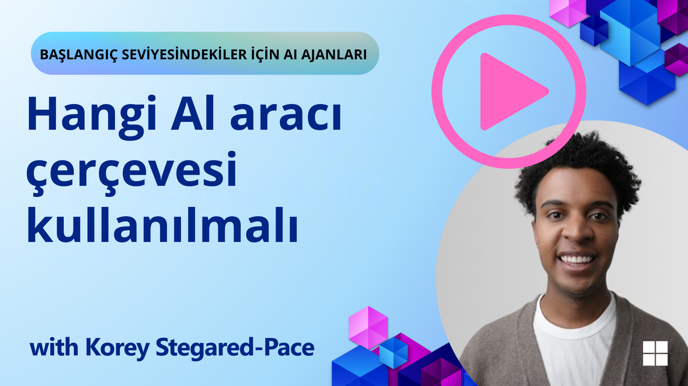

[](https://youtu.be/ODwF-EZo_O8?si=1xoy_B9RNQfrYdF7)

> _(Dersi izlemek için yukarıdaki resme tıklayın)_

# AI Ajan Çerçevelerini Keşfetme

AI ajan çerçeveleri, AI ajanlarının oluşturulmasını, dağıtılmasını ve yönetilmesini kolaylaştırmak için tasarlanmış yazılım platformlarıdır. Bu çerçeveler, geliştiricilere karmaşık AI sistemlerinin geliştirilmesini kolaylaştıran hazır bileşenler, soyutlamalar ve araçlar sunar.

Bu çerçeveler, geliştiricilerin AI ajan geliştirmedeki ortak zorluklara standart yaklaşımlar sunarak, uygulamalarının benzersiz yönlerine odaklanmalarını sağlar. AI sistemlerinin oluşturulmasında ölçeklenebilirlik, erişilebilirlik ve verimliliği artırırlar.

## Giriş

Bu derste şunları öğreneceğiz:

- AI Ajan Çerçeveleri nedir ve geliştiricilerin neler yapmasını sağlar?
- Ekipler, ajanların yeteneklerini hızlıca prototiplemek, yinelemek ve geliştirmek için bunları nasıl kullanabilir?
- Microsoft'un <a href="https://aka.ms/ai-agents/autogen" target="_blank">AutoGen</a>, <a href="https://aka.ms/ai-agents-beginners/semantic-kernel" target="_blank">Semantic Kernel</a> ve <a href="https://aka.ms/ai-agents-beginners/ai-agent-service" target="_blank">Azure AI Ajan Servisi</a> tarafından oluşturulan çerçeveler ve araçlar arasındaki farklar nelerdir?
- Mevcut Azure ekosistem araçlarımı doğrudan entegre edebilir miyim, yoksa bağımsız çözümlere mi ihtiyacım var?
- Azure AI Ajanları servisi nedir ve bana nasıl yardımcı oluyor?

## Öğrenme Hedefleri

Bu dersin hedefleri şunları anlamanıza yardımcı olmaktır:

- AI Ajan Çerçevelerinin AI geliştirmedeki rolü
- Akıllı ajanlar oluşturmak için AI Ajan Çerçevelerinden nasıl yararlanılır
- AI Ajan Çerçeveleri tarafından sağlanan temel yetenekler
- AutoGen, Semantic Kernel ve Azure AI Ajan Servisi arasındaki farklar

## AI Ajan Çerçeveleri Nedir ve Geliştiricilerin Neler Yapmasını Sağlar?

Geleneksel AI Çerçeveleri, uygulamalarınıza AI entegre etmenize ve bu uygulamaları şu şekillerde geliştirmenize yardımcı olabilir:

- **Kişiselleştirme**: AI, kullanıcı davranışlarını ve tercihlerini analiz ederek kişiselleştirilmiş öneriler, içerik ve deneyimler sunabilir.
Örnek: Netflix gibi yayın hizmetleri, kullanıcı etkileşimini ve memnuniyetini artırmak için izleme geçmişine dayalı olarak film ve diziler önerir.
- **Otomasyon ve Verimlilik**: AI, tekrarlayan görevleri otomatikleştirebilir, iş akışlarını düzenleyebilir ve operasyonel verimliliği artırabilir.
Örnek: Müşteri hizmetleri uygulamaları, yaygın soruları yanıtlamak için AI destekli sohbet robotlarını kullanarak yanıt sürelerini azaltır ve insan temsilcilerini daha karmaşık konular için serbest bırakır.
- **Gelişmiş Kullanıcı Deneyimi**: AI, ses tanıma, doğal dil işleme ve tahmin edici metin gibi akıllı özellikler sunarak genel kullanıcı deneyimini iyileştirebilir.
Örnek: Siri ve Google Assistant gibi sanal asistanlar, kullanıcıların cihazlarıyla etkileşimini kolaylaştırmak için ses komutlarını anlamak ve yanıtlamak için AI kullanır.

### Bu kadar harika görünüyor, peki neden AI Ajan Çerçevesine ihtiyacımız var?

AI Ajan çerçeveleri, sadece AI çerçevelerinden daha fazlasını temsil eder. Bunlar, belirli hedeflere ulaşmak için kullanıcılarla, diğer ajanlarla ve çevreyle etkileşime girebilen akıllı ajanların oluşturulmasını sağlar. Bu ajanlar, otonom davranışlar sergileyebilir, kararlar alabilir ve değişen koşullara uyum sağlayabilir. AI Ajan Çerçeveleri tarafından sağlanan bazı temel yeteneklere bakalım:

- **Ajan İşbirliği ve Koordinasyonu**: Karmaşık görevleri çözmek için birlikte çalışabilen, iletişim kurabilen ve koordine olabilen birden fazla AI ajanı oluşturmayı sağlar.
- **Görev Otomasyonu ve Yönetimi**: Ajanlar arasında çok adımlı iş akışlarını otomatikleştirmek, görev devretme ve dinamik görev yönetimi için mekanizmalar sağlar.
- **Bağlamsal Anlama ve Uyum**: Ajanlara bağlamı anlama, değişen ortamlara uyum sağlama ve gerçek zamanlı bilgilere dayalı kararlar alma yeteneği kazandırır.

Özetle, ajanlar daha fazlasını yapmanızı, otomasyonu bir üst seviyeye taşımanızı ve çevresinden öğrenip uyum sağlayabilen daha akıllı sistemler oluşturmanızı sağlar.

## Ajan Yeteneklerini Hızlıca Prototipleme, Yineleme ve Geliştirme

Bu alan hızlı bir şekilde gelişiyor, ancak çoğu AI Ajan Çerçevesinde ortak olan ve hızlı prototipleme ve yineleme yapmanıza yardımcı olabilecek bazı özellikler var: modül bileşenleri, işbirlikçi araçlar ve gerçek zamanlı öğrenme. Bunları inceleyelim:

- **Modüler Bileşenleri Kullanın**: AI SDK'ları, AI ve Bellek bağlayıcıları, doğal dil veya kod eklentileri kullanarak fonksiyon çağırma, prompt şablonları ve daha fazlası gibi hazır bileşenler sunar.
- **İşbirlikçi Araçlardan Yararlanın**: Belirli rollere ve görevlere sahip ajanlar tasarlayarak, işbirlikçi iş akışlarını test etmelerini ve iyileştirmelerini sağlayın.
- **Gerçek Zamanlı Öğrenin**: Ajanların etkileşimlerden öğrenip davranışlarını dinamik olarak ayarladığı geri bildirim döngüleri uygulayın.

### İşbirlikçi Araçlardan Yararlanın

CrewAI, Microsoft AutoGen ve Semantic Kernel gibi çerçeveler, birlikte çalışabilen birden fazla ajan oluşturmayı kolaylaştırır.

**Ekipler bunları nasıl kullanabilir**: Ekipler, belirli rollere ve görevlere sahip ajanlar tasarlayarak, işbirlikçi iş akışlarını test edebilir ve iyileştirebilir, böylece genel sistem verimliliğini artırabilir.

**Pratikte nasıl çalışır**: Veri alımı, analiz veya karar verme gibi özel bir işleve sahip bir ajan ekibi oluşturabilirsiniz. Bu ajanlar, kullanıcı sorgusunu yanıtlamak veya bir görevi tamamlamak gibi ortak bir hedefe ulaşmak için iletişim kurabilir ve bilgi paylaşabilir.

**Örnek kod (AutoGen)**:

```python
# creating agents, then create a round robin schedule where they can work together, in this case in order

# Data Retrieval Agent
# Data Analysis Agent
# Decision Making Agent

agent_retrieve = AssistantAgent(
    name="dataretrieval",
    model_client=model_client,
    tools=[retrieve_tool],
    system_message="Use tools to solve tasks."
)

agent_analyze = AssistantAgent(
    name="dataanalysis",
    model_client=model_client,
    tools=[analyze_tool],
    system_message="Use tools to solve tasks."
)

# conversation ends when user says "APPROVE"
termination = TextMentionTermination("APPROVE")

user_proxy = UserProxyAgent("user_proxy", input_func=input)

team = RoundRobinGroupChat([agent_retrieve, agent_analyze, user_proxy], termination_condition=termination)

stream = team.run_stream(task="Analyze data", max_turns=10)
# Use asyncio.run(...) when running in a script.
await Console(stream)
```

Önceki kodda gördüğünüz gibi, verileri analiz etmek için birden fazla ajanın birlikte çalıştığı bir görev oluşturabilirsiniz. Her ajan belirli bir işlevi yerine getirir ve görev, ajanların koordine edilmesiyle istenen sonuca ulaşılır. Özel rollere sahip ayrılmış ajanlar oluşturarak görev verimliliğini ve performansını artırabilirsiniz.

### Gerçek Zamanlı Öğrenin

Gelişmiş çerçeveler, gerçek zamanlı bağlam anlama ve uyum sağlama yetenekleri sunar.

**Ekipler bunları nasıl kullanabilir**: Ekipler, ajanların etkileşimlerden öğrenip davranışlarını dinamik olarak ayarladığı geri bildirim döngüleri uygulayabilir, bu da sürekli iyileştirme ve yeteneklerin iyileştirilmesine yol açar.

**Pratikte nasıl çalışır**: Ajanlar, kullanıcı geri bildirimlerini, çevresel verileri ve görev sonuçlarını analiz ederek bilgi tabanlarını güncelleyebilir, karar verme algoritmalarını ayarlayabilir ve zamanla performanslarını iyileştirebilir. Bu yinelemeli öğrenme süreci, ajanların değişen koşullara ve kullanıcı tercihlerine uyum sağlamasına olanak tanır, böylece genel sistem etkinliğini artırır.

## AutoGen, Semantic Kernel ve Azure AI Ajan Servisi Arasındaki Farklar Nelerdir?

Bu çerçeveleri birçok açıdan karşılaştırabiliriz, ancak tasarımları, yetenekleri ve hedef kullanım senaryoları açısından bazı temel farklara bakalım:

## AutoGen

AutoGen, Microsoft Research'in AI Frontiers Lab tarafından geliştirilen açık kaynaklı bir çerçevedir. Olay tabanlı, dağıtılmış *ajanik* uygulamalara odaklanır ve birden fazla LLM ve SLM, araçlar ve gelişmiş çoklu ajan tasarım desenlerini etkinleştirir.

AutoGen, ajanlar etrafında inşa edilmiştir. Ajanlar, çevrelerini algılayabilen, kararlar alabilen ve belirli hedeflere ulaşmak için eylemler gerçekleştirebilen otonom varlıklardır. Ajanlar asenkron mesajlar aracılığıyla iletişim kurar, bu da onların bağımsız ve paralel çalışmasına olanak tanır, böylece sistem ölçeklenebilirliğini ve yanıt verme yeteneğini artırır.

<a href="https://en.wikipedia.org/wiki/Actor_model" target="_blank">Ajanlar, aktör modeline dayanır</a>. Wikipedia'ya göre, bir aktör, *eşzamanlı hesaplamanın temel yapı taşıdır. Aldığı bir mesaja yanıt olarak, bir aktör şunları yapabilir: yerel kararlar alabilir, daha fazla aktör oluşturabilir, daha fazla mesaj gönderebilir ve bir sonraki alınan mesaja nasıl yanıt vereceğini belirleyebilir*.

**Kullanım Senaryoları**: Kod oluşturma, veri analizi görevlerini otomatikleştirme ve planlama ve araştırma işlevleri için özel ajanlar oluşturma.

AutoGen'in bazı önemli temel kavramları şunlardır:

- **Ajanlar**. Bir ajan şu özelliklere sahip bir yazılım varlığıdır:
  - **Mesajlar aracılığıyla iletişim kurar**, bu mesajlar senkron veya asenkron olabilir.
  - **Kendi durumunu korur**, gelen mesajlarla değiştirilebilir.
  - **Eylemler gerçekleştirir**, alınan mesajlara veya durumundaki değişikliklere yanıt olarak. Bu eylemler, ajanın durumunu değiştirebilir ve mesaj günlüklerini güncelleme, yeni mesajlar gönderme, kod çalıştırma veya API çağrıları yapma gibi harici etkiler üretebilir.
    
  İşte Chat yeteneklerine sahip kendi ajanınızı oluşturduğunuz kısa bir kod parçası:

    ```python
    from autogen_agentchat.agents import AssistantAgent
    from autogen_agentchat.messages import TextMessage
    from autogen_ext.models.openai import OpenAIChatCompletionClient


    class MyAssistant(RoutedAgent):
        def __init__(self, name: str) -> None:
            super().__init__(name)
            model_client = OpenAIChatCompletionClient(model="gpt-4o")
            self._delegate = AssistantAgent(name, model_client=model_client)
    
        @message_handler
        async def handle_my_message_type(self, message: MyMessageType, ctx: MessageContext) -> None:
            print(f"{self.id.type} received message: {message.content}")
            response = await self._delegate.on_messages(
                [TextMessage(content=message.content, source="user")], ctx.cancellation_token
            )
            print(f"{self.id.type} responded: {response.chat_message.content}")
    ```
    
    In the previous code, `MyAssistant` has been created and inherits from `RoutedAgent`. It has a message handler that prints the content of the message and then sends a response using the `AssistantAgent` delegate. Especially note how we assign to `self._delegate` an instance of `AssistantAgent` which is a pre-built agent that can handle chat completions.


    Let's let AutoGen know about this agent type and kick off the program next:

    ```python
    
    # main.py
    runtime = SingleThreadedAgentRuntime()
    await MyAgent.register(runtime, "my_agent", lambda: MyAgent())

    runtime.start()  # Start processing messages in the background.
    await runtime.send_message(MyMessageType("Hello, World!"), AgentId("my_agent", "default"))
    ```

    In the previous code the agents are registered with the runtime and then a message is sent to the agent resulting in the following output:

    ```text
    # Output from the console:
    my_agent received message: Hello, World!
    my_assistant received message: Hello, World!
    my_assistant responded: Hello! How can I assist you today?
    ```

- **Çoklu ajanlar**. AutoGen, karmaşık görevleri başarmak için birlikte çalışabilen birden fazla ajan oluşturmayı destekler. Ajanlar iletişim kurabilir, bilgi paylaşabilir ve eylemlerini koordine edebilir, böylece sorunları daha verimli bir şekilde çözebilir. Çoklu ajan sistemi oluşturmak için, veri alımı, analiz, karar verme ve kullanıcı etkileşimi gibi özel işlevlere ve rollere sahip farklı türde ajanlar tanımlayabilirsiniz. Böyle bir oluşturmanın nasıl göründüğüne bakalım:

    ```python
    editor_description = "Editor for planning and reviewing the content."

    # Example of declaring an Agent
    editor_agent_type = await EditorAgent.register(
    runtime,
    editor_topic_type,  # Using topic type as the agent type.
    lambda: EditorAgent(
        description=editor_description,
        group_chat_topic_type=group_chat_topic_type,
        model_client=OpenAIChatCompletionClient(
            model="gpt-4o-2024-08-06",
            # api_key="YOUR_API_KEY",
        ),
        ),
    )

    # remaining declarations shortened for brevity

    # Group chat
    group_chat_manager_type = await GroupChatManager.register(
    runtime,
    "group_chat_manager",
    lambda: GroupChatManager(
        participant_topic_types=[writer_topic_type, illustrator_topic_type, editor_topic_type, user_topic_type],
        model_client=OpenAIChatCompletionClient(
            model="gpt-4o-2024-08-06",
            # api_key="YOUR_API_KEY",
        ),
        participant_descriptions=[
            writer_description, 
            illustrator_description, 
            editor_description, 
            user_description
        ],
        ),
    )
    ```

    In the previous code we have a `GroupChatManager` that is registered with the runtime. This manager is responsible for coordinating the interactions between different types of agents, such as writers, illustrators, editors, and users.

- **Ajan Çalışma Zamanı**. Çerçeve, ajanlar arasında iletişimi sağlayan, kimliklerini ve yaşam döngülerini yöneten ve güvenlik ve gizlilik sınırlarını uygulayan bir çalışma zamanı ortamı sağlar. Bu, ajanlarınızı güvenli ve kontrollü bir ortamda çalıştırabileceğiniz anlamına gelir, böylece güvenli ve verimli bir şekilde etkileşime girebilirler. İki ilgi çekici çalışma zamanı vardır:
  - **Bağımsız çalışma zamanı**. Tüm ajanların aynı programlama dilinde uygulandığı ve aynı süreçte çalıştığı tek süreçli uygulamalar için iyi bir seçimdir. İşte nasıl çalıştığının bir örneği:
  
    <a href="https://microsoft.github.io/autogen/stable/_images/architecture-standalone.svg" target="_blank">Bağımsız çalışma zamanı</a>   
Uygulama yığını

    *ajanlar çalışma zamanı aracılığıyla mesajlarla iletişim kurar ve çalışma zamanı ajanların yaşam döngüsünü yönetir*

  - **Dağıtılmış ajan çalışma zamanı**, ajanların farklı programlama dillerinde uygulanabileceği ve farklı makinelerde çalışabileceği çoklu süreç uygulamaları için uygundur. İşte nasıl çalıştığının bir örneği:
  
    <a href="https://microsoft.github.io/autogen/stable/_images/architecture-distributed.svg" target="_blank">Dağıtılmış çalışma zamanı</a>

## Semantic Kernel + Ajan Çerçevesi

Semantic Kernel, kurumsal kullanıma hazır bir AI Orkestrasyon SDK'sıdır. AI ve bellek bağlayıcıları ile birlikte bir Ajan Çerçevesi içerir.

Önce bazı temel bileşenleri inceleyelim:

- **AI Bağlayıcıları**: Bu, hem Python hem de C# için harici AI servisleri ve veri kaynaklarıyla bir arayüzdür.

  ```python
  # Semantic Kernel Python
  from semantic_kernel.connectors.ai.open_ai import AzureChatCompletion
  from semantic_kernel.kernel import Kernel

  kernel = Kernel()
  kernel.add_service(
    AzureChatCompletion(
        deployment_name="your-deployment-name",
        api_key="your-api-key",
        endpoint="your-endpoint",
    )
  )
  ```  

    ```csharp
    // Semantic Kernel C#
    using Microsoft.SemanticKernel;

    // Create kernel
    var builder = Kernel.CreateBuilder();
    
    // Add a chat completion service:
    builder.Services.AddAzureOpenAIChatCompletion(
        "your-resource-name",
        "your-endpoint",
        "your-resource-key",
        "deployment-model");
    var kernel = builder.Build();
    ```

    Burada, bir kernel oluşturma ve bir sohbet tamamlama servisi ekleme örneğini görüyorsunuz. Semantic Kernel, bu durumda Azure OpenAI Sohbet Tamamlama olan harici bir AI servisine bağlantı oluşturur.

- **Eklentiler**: Bunlar, bir uygulamanın kullanabileceği fonksiyonları kapsüller. Hem hazır eklentiler hem de oluşturabileceğiniz özel eklentiler vardır. İlgili bir kavram da "prompt fonksiyonları"dır. Fonksiyon çağırma için doğal dil ipuçları sağlamak yerine, belirli fonksiyonları modele yayınlarsınız. Mevcut sohbet bağlamına göre, model bir isteği veya sorguyu tamamlamak için bu fonksiyonlardan birini çağırmayı seçebilir. İşte bir örnek:

  ```python
  from semantic_kernel.connectors.ai.open_ai.services.azure_chat_completion import AzureChatCompletion


  async def main():
      from semantic_kernel.functions import KernelFunctionFromPrompt
      from semantic_kernel.kernel import Kernel

      kernel = Kernel()
      kernel.add_service(AzureChatCompletion())

      user_input = input("User Input:> ")

      kernel_function = KernelFunctionFromPrompt(
          function_name="SummarizeText",
          prompt="""
          Summarize the provided unstructured text in a sentence that is easy to understand.
          Text to summarize: {{$user_input}}
          """,
      )

      response = await kernel_function.invoke(kernel=kernel, user_input=user_input)
      print(f"Model Response: {response}")

      """
      Sample Console Output:

      User Input:> I like dogs
      Model Response: The text expresses a preference for dogs.
      """


  if __name__ == "__main__":
    import asyncio
    asyncio.run(main())
  ```

    ```csharp
    var userInput = Console.ReadLine();

    // Define semantic function inline.
    string skPrompt = @"Summarize the provided unstructured text in a sentence that is easy to understand.
                        Text to summarize: {{$userInput}}";
    
    // create the function from the prompt
    KernelFunction summarizeFunc = kernel.CreateFunctionFromPrompt(
        promptTemplate: skPrompt,
        functionName: "SummarizeText"
    );

    //then import into the current kernel
    kernel.ImportPluginFromFunctions("SemanticFunctions", [summarizeFunc]);

    ```

    Burada, önce kullanıcının metin girmesi için yer bırakan bir şablon prompt `skPrompt` var, `$userInput`. Sonra kernel fonksiyonu `SummarizeText`'i oluşturuyorsunuz ve ardından eklenti adı `SemanticFunctions` ile kerneli içe aktarıyorsunuz. Fonksiyonun adının, Semantic Kernel'in fonksiyonun ne yaptığını ve ne zaman çağrılması gerektiğini anlamasına yardımcı olduğuna dikkat edin.

- **Yerel fonksiyon**: Çerçevenin görevi gerçekleştirmek için doğrudan çağırabileceği yerel fonksiyonlar da vardır. İşte bir dosyadan içerik alan böyle bir fonksiyonun örneği:

    ```csharp
    public class NativeFunctions {

        [SKFunction, Description("Retrieve content from local file")]
        public async Task<string> RetrieveLocalFile(string fileName, int maxSize = 5000)
        {
            string content = await File.ReadAllTextAsync(fileName);
            if (content.Length <= maxSize) return content;
            return content.Substring(0, maxSize);
        }
    }
    
    //Import native function
    string plugInName = "NativeFunction";
    string functionName = "RetrieveLocalFile";

   //To add the functions to a kernel use the following function
    kernel.ImportPluginFromType<NativeFunctions>();

    ```

- **Bellek**: AI uygulamaları için bağlam yönetimini soyutlar ve basitleştirir. Bellek fikri, bunun LLM'in bilmesi gereken bir şey olmasıdır. Bu bilgiyi bir vektör deposunda saklayabilirsiniz, bu da bir bellek içi veritabanı veya bir vektör veritabanı veya benzeri olur. İşte *gerçeklerin* belleğe eklendiği çok basitleştirilmiş bir senaryo örneği:

    ```csharp
    var facts = new Dictionary<string,string>();
    facts.Add(
        "Azure Machine Learning; https://learn.microsoft.com/azure/machine-learning/",
        @"Azure Machine Learning is a cloud service for accelerating and
        managing the machine learning project lifecycle. Machine learning professionals,
        data scientists, and engineers can use it in their day-to-day workflows"
    );
    
    facts.Add(
        "Azure SQL Service; https://learn.microsoft.com/azure/azure-sql/",
        @"Azure SQL is a family of managed, secure, and intelligent products
        that use the SQL Server database engine in the Azure cloud."
    );
    
    string memoryCollectionName = "SummarizedAzureDocs";
    
    foreach (var fact in facts) {
        await memoryBuilder.SaveReferenceAsync(
            collection: memoryCollectionName,
            description: fact.Key.Split(";")[1].Trim(),
            text: fact.Value,
            externalId: fact.Key.Split(";")[2].Trim(),
            externalSourceName: "Azure Documentation"
        );
    }
    ```

    Bu gerçekler daha sonra `SummarizedAzureDocs` bellek koleksiyonunda saklanır. Bu çok basitleştirilmiş bir örnek, ancak LLM'in kullanması için bilgileri bellekte nasıl saklayabileceğinizi görebilirsiniz.

İşte Semantic Kernel çerçevesinin temelleri, peki Ajan Çerçevesi hakkında ne diyebiliriz?

## Azure AI Ajan Servisi

Azure AI Ajan Servisi, Microsoft Ignite 2024'te tanıtılan daha yeni bir eklentidir. Llama 3, Mistral ve Cohere gibi açık kaynaklı LLM'leri doğrudan çağırmak gibi daha esnek modellerle AI ajanlarının geliştirilmesine ve dağıtılmasına olanak tanır.

Azure AI Ajan Servisi, daha güçlü kurumsal güvenlik mekanizmaları ve veri depolama yöntemleri sunarak kurumsal uygulamalar için uygun hale getirir.

AutoGen ve Semantic Kernel gibi çoklu ajan orkestrasyon çerçeveleriyle hazır olarak çalışır.

Bu servis şu anda Genel Önizleme aşamasındadır ve ajanlar oluşturmak için Python ve C#'ı destekler.

Semantic Kernel Python kullanarak, kullanıcı tanımlı bir eklenti ile bir Azure AI Ajanı oluşturabiliriz:

```python
import asyncio
from typing import Annotated

from azure.identity.aio import DefaultAzureCredential

from semantic_kernel.agents.azure_ai import AzureAIAgent, AzureAIAgentSettings
from semantic_kernel.contents.chat_message_content import ChatMessageContent
from semantic_kernel.contents.utils.author_role import AuthorRole
from semantic_kernel.functions.kernel_function_decorator import kernel_function


# Define a sample plugin for the sample
class MenuPlugin:
    """A sample Menu Plugin used for the concept sample."""

    @kernel_function(description="Provides a list of specials from the menu.")
    def get_specials(self) -> Annotated[str, "Returns the specials from the menu."]:
        return """
        Special Soup: Clam Chowder
        Special Salad: Cobb Salad
        Special Drink: Chai Tea
        """

    @kernel_function(description="Provides the price of the requested menu item.")
    def get_item_price(
        self, menu_item: Annotated[str, "The name of the menu item."]
    ) -> Annotated[str, "Returns the price of the menu item."]:
        return "$9.99"


async def main() -> None:
    ai_agent_settings = AzureAIAgentSettings.create()

    async with (
        DefaultAzureCredential() as creds,
        AzureAIAgent.create_client(
            credential=creds,
            conn_str=ai_agent_settings.project_connection_string.get_secret_value(),
        ) as client,
    ):
        # Create agent definition
        agent_definition = await client.agents.create_agent(
            model=ai_agent_settings.model_deployment_name,
            name="Host",
            instructions="Answer questions about the menu.",
        )

        # Create the AzureAI Agent using the defined client and agent definition
        agent = AzureAIAgent(
            client=client,
            definition=agent_definition,
        )

        # Add the sample plugin to the kernel
        agent.kernel.add_plugin(MenuPlugin(), plugin_name="menu")

        # Create a new thread
        thread = await client.agents.create_thread()

        user_inputs = [
            "Hello",
            "What is the special soup?",
            "How much does that cost?",
            "Thank you",
        ]

        try:
            for user_input in user_inputs:
                # Add the user input as a chat message
                await agent.add_chat_message(
                    thread_id=thread.id, message=ChatMessageContent(role=AuthorRole.USER, content=user_input)
                )
                print(f"# User: '{user_input}'")
                # Invoke the agent for the specified thread
                async for content in agent.invoke(
                    thread_id=thread.id,
                ):
                    print(f"# Agent: {content.content}")
        finally:
            await client.agents.delete_thread(thread.id)
            await client.agents.delete_agent(agent.id)


if __name__ == "__main__":
    asyncio.run(main())
```

### Temel kavramlar

Azure AI Ajan Servisi'nin aşağıdaki temel kavramları vardır:

- **Ajan**. Azure AI Ajan Servisi, Azure AI Foundry ile entegre olur. AI Foundry içinde, bir AI Ajanı, soruları yanıtlamak (RAG), eylemler gerçekleştirmek veya iş akışlarını tamamen otomatikleştirmek için kullanılabilecek "akıllı" bir mikroservis olarak hareket eder. Bunu, gerçek dünya veri kaynaklarına erişmesine ve bunlarla etkileşime girmesine olanak tanıyan araçlarla birlikte üretken AI modellerinin gücünü birleştirerek başarır. İşte bir ajan örneği:

    ```python
    agent = project_client.agents.create_agent(
        model="gpt-4o-mini",
        name="my-agent",
        instructions="You are helpful agent",
        tools=code_interpreter.definitions,
        tool_resources=code_interpreter.resources,
    )
    ```

    Bu örnekte, `gpt-4o-mini` modeli, `my-agent` adı ve `You are helpful agent` talimatlarıyla bir ajan oluşturulur. Ajan, kod yorumlama görevlerini gerçekleştirmek için araçlar ve kaynaklarla donatılmıştır.

- **İş parçacığı ve mesajlar**. İş parçacığı başka bir önemli kavramdır. Bir ajan ve bir kullanıcı arasındaki bir konuşmayı veya etkileşimi temsil eder. İş parçacıkları, bir konuşmanın ilerlemesini takip etmek, bağlam bilgilerini depolamak ve etkileşimin durumunu yönetmek için kullanılabilir. İşte bir iş parçacığı örneği:

    ```python
    thread = project_client.agents.create_thread()
    message = project_client.agents.create_message(
        thread_id=thread.id,
        role="user",
        content="Could you please create a bar chart for the operating profit using the following data and provide the file to me? Company A: $1.2 million, Company B: $2.5 million, Company C: $3.0 million, Company D: $1.8 million",
    )
    
    # Ask the agent to perform work on the thread
    run = project_client.agents.create_and_process_run(thread_id=thread.id, agent_id=agent.id)
    
    # Fetch and log all messages to see the agent's response
    messages = project_client.agents.list_messages(thread_id=thread.id)
    print(f"Messages: {messages}")
    ```

    Önceki kodda, bir iş parçacığı oluşturulur. Daha sonra, iş parçacığına bir mesaj gönderilir. By calling `create_and_process_run`, the agent is asked to perform work on the thread. Finally, the messages are fetched and logged to see the agent's response. The messages indicate the progress of the conversation between the user and the agent. It's also important to understand that the messages can be of different types such as text, image, or file, that is the agents work has resulted in for example an image or a text response for example. As a developer, you can then use this information to further process the response or present it to the user.

- **Diğer AI çerçeveleriyle entegre olur**. Azure AI Ajan servisi, AutoGen ve Semantic Kernel gibi diğer çerçevelerle etkileşime girebilir, bu da uygulamanızın bir kısmını bu çerçevelerden birinde oluşturabileceğiniz ve örneğin Ajan servisini bir orkestratör olarak kullanabileceğiniz veya her şeyi Ajan servisinde oluşturabileceğiniz anlamına gelir.

**Kullanım Senaryoları**: Azure AI Ajan Servisi, güvenli, ölçeklenebilir ve esnek AI ajan dağıtımı gerektiren kurumsal uygulamalar için tasarlanmıştır.

## Bu çerçeveler arasındaki fark nedir?
 
Bu çerçeveler arasında çok fazla örtüşme var gibi görünüyor, ancak tasarımları, yetenekleri ve hedef kullanım senaryoları açısından bazı önemli farklar var:
 
- **AutoGen**: Çoklu ajan sistemleri üzerinde öncü araştırmalara odaklanan bir deney çerçevesidir. Karmaşık çoklu ajan sistemlerini denemek ve prototiplemek için en iyi yerdir.
- **Semantic Kernel**: Kurumsal ajanik uygulamalar oluşturmak için üretime hazır bir ajan kütüphanesidir. Olay tabanlı, dağıtılmış ajanik uygulamalara odaklanır, birden fazla LLM ve SLM, araçlar ve tek/çoklu ajan tasarım desenlerini etkinleştirir.
- **Azure AI Ajan Servisi**: Azure Foundry'de ajanlar için bir platform ve dağıtım servisidir. Azure Found tarafından desteklenen Azure OpenAI, Azure AI Search, Bing Search ve kod yürütme gibi servislere bağlantı kurma imkanı sunar.
 
Hala hangisini seçeceğinizden emin değil misiniz?

### Kullanım Senaryoları
 
Bazı yaygın kullanım senaryolarını inceleyerek size yardımcı olmaya çalışalım:
 
> S: Deney yapıyorum, öğreniyorum ve kavram kanıtı ajan uygulamaları oluşturuyorum ve hızlı bir şekilde oluşturup deney yapabilmek istiyorum
>

>C: AutoGen bu senaryo için iyi bir seçim olacaktır, çünkü olay tabanlı, dağıtılmış ajanik uygulamalara odaklanır ve gelişmiş çoklu ajan tasarım desenlerini destekler.

> S: AutoGen'i Semantic Kernel ve Azure AI Ajan Servisi'nden daha iyi bir seçim yapan nedir?
>
> C: AutoGen, olay tabanlı, dağıtılmış ajanik uygulamalar için özel olarak tasarlanmıştır, bu da onu kod oluşturma ve veri analizi görevlerini otomatikleştirmek için uygun hale getirir. Karmaşık çoklu ajan sistemlerini verimli bir şekilde oluşturmak için gerekli araçları ve yetenekleri sağlar.

>S: Azure AI Ajan Servisi de burada çalışabilir gibi görünüyor, kod oluşturma ve daha fazlası için araçları var?
>
> C: Evet, Azure AI Ajan Servisi, ajanlar için bir platform servisidir ve birden fazla model, Azure AI Search, Bing Search ve Azure Functions için yerleşik yetenekler ekler. Ajanlarınızı Foundry Portal'da oluşturmayı ve ölçekte dağıtmayı kolaylaştırır.
 
> S: Hala kafam karışık, sadece bir seçenek ver
>
> C: Harika bir seçim, önce uygulamanızı Semantic Kernel'de oluşturmak ve ardından ajanınızı dağıtmak için Azure AI Ajan Servisi'ni kullanmaktır. Bu yaklaşım, ajanlarınızı kolayca kalıcı hale getirirken Semantic Kernel'de çoklu ajan sistemleri oluşturma gücünden yararlanmanıza olanak tanır. Ek olarak, Semantic Kernel'in AutoGen'de bir bağlayıcısı vardır, bu da her iki çerçeveyi birlikte kullanmayı kolaylaştırır.
 
Temel farklılıkları bir tabloda özetleyelim:

| Çerçeve | Odak | Temel Kavramlar | Kullanım Senaryoları |
| --- | --- | --- | --- |
| AutoGen | Olay tabanlı, dağıtılmış ajanik uygulamalar | Ajanlar, Kişilikler, Fonksiyonlar, Veri | Kod oluşturma, veri analizi görevleri |
| Semantic Kernel | İnsan benzeri metin içeriğini anlama ve oluşturma | Ajanlar, Modüler Bileşenler, İşbirliği | Doğal dil anlama, içerik oluşturma |
| Azure AI Ajan Servisi | Esnek modeller, kurumsal güvenlik, Kod oluşturma, Araç çağırma | Modülerlik, İşbirliği, Süreç Orkestrasyonu | Güvenli, ölçeklenebilir ve esnek AI ajan dağıtımı |

Bu çerçevelerin her biri için ideal kullanım senaryosu nedir?

## Mevcut Azure ekosistem araçlarımı doğrudan entegre edebilir miyim, yoksa bağımsız çözümlere mi ihtiyacım var?

Cevap evet, özellikle Azure AI Ajan Servisi ile mevcut Azure ekosistem araçlarınızı doğrudan entegre edebilirsiniz, çünkü diğer Azure servisleriyle sorunsuz çalışacak şekilde oluşturulmuştur. Örneğin Bing, Azure AI Search ve Azure Functions'ı entegre edebilirsiniz. Ayrıca Azure AI Foundry ile derin entegrasyon vardır.

AutoGen ve Semantic Kernel için de Azure servisleriyle entegre olabilirsiniz, ancak bu Azure servislerini kodunuzdan çağırmanızı gerektirebilir. Entegre etmenin başka bir yolu da, ajanlarınızdan Azure servisleriyle etkileşim kurmak için Azure SDK'larını kullanmaktır. Ek olarak, bahsedildiği gibi, AutoGen veya Semantic Kernel'de oluşturulan ajanlarınız için bir orkestratör olarak Azure AI Ajan Servisi'ni kullanabilirsiniz, bu da Azure ekosistemine kolay erişim sağlar.

## Referanslar

- <a href="https://techcommunity.microsoft.com/blog/azure-ai-services-blog/introducing-azure-ai-agent-service/4298357" target="_blank">Azure Agent Service</a>
- <a href="https://devblogs.microsoft.com/semantic-kernel/microsofts-agentic-ai-frameworks-autogen-and-semantic-kernel/" target="_blank">Semantic Kernel and AutoGen</a>
- <a href="https://learn.microsoft.com/semantic-kernel/frameworks/agent/?pivots=programming-language-python" target="_blank">Semantic Kernel Python Agent Framework</a>
- <a href="https://learn.microsoft.com/semantic-kernel/frameworks/agent/?pivots=programming-language-csharp" target="_blank">Semantic Kernel .Net Agent Framework</a>
- <a href="https://learn.microsoft.com/azure/ai-services/agents/overview" target="_blank">Azure AI Agent service</a>
- <a href="https://techcommunity.microsoft.com/blog/educatordeveloperblog/using-azure-ai-agent-service-with-autogen--semantic-kernel-to-build-a-multi-agen/4363121" target="_blank">Using Azure AI Agent Service with AutoGen / Semantic Kernel to build a multi-agent's solution</a>

## Önceki Ders

[AI Ajanlarına Giriş ve Ajan Kullanım Senaryoları](../01-intro-to-ai-agents/README.md)

## Sonraki Ders

[Ajanik Tasarım Desenlerini Anlama](../03-agentic-design-patterns/README.md)
