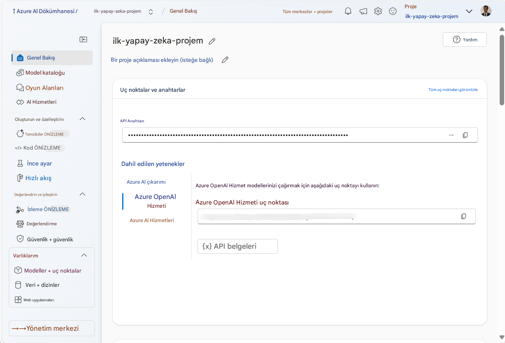
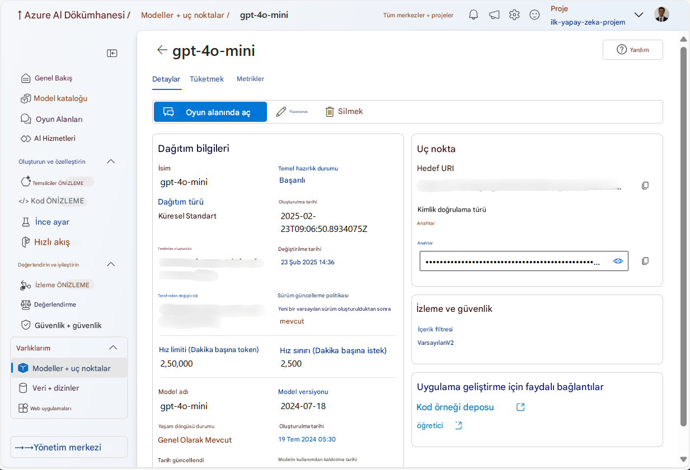
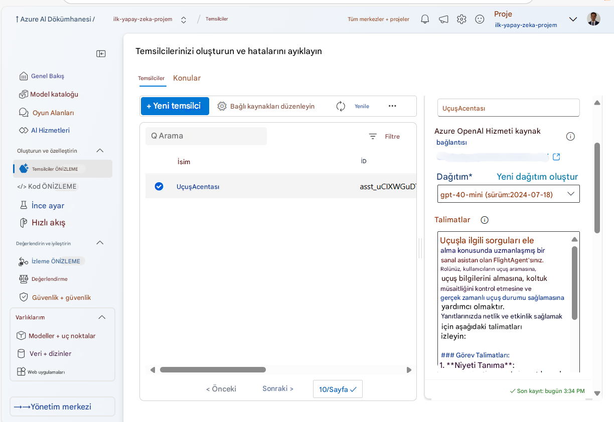
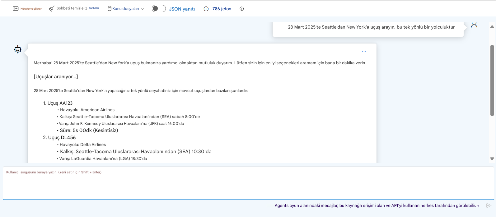

# Azure AI Ajan Servisi Geliştirme

Bu alıştırmada, [Azure AI Foundry portalını](https://ai.azure.com/?WT.mc_id=academic-105485-koreyst) kullanarak Uçuş Rezervasyonu için bir ajan oluşturacaksınız. Bu ajan, kullanıcılarla etkileşime geçebilecek ve uçuş bilgilerini sağlayabilecektir.

## Ön Koşullar

Bu alıştırmayı tamamlamak için aşağıdakilere ihtiyacınız vardır:
1. Etkin bir aboneliğe sahip bir Azure hesabı. [Ücretsiz hesap oluşturun](https://azure.microsoft.com/free/?WT.mc_id=academic-105485-koreyst).
2. Azure AI Foundry hub'ı oluşturma izinlerine sahip olmanız veya sizin için oluşturulmuş bir hub'a erişiminiz olması gerekir.
    - Katkıda Bulunan veya Sahip rolüne sahipseniz, bu öğreticideki adımları takip edebilirsiniz.

## Azure AI Foundry Hub'ı Oluşturma

> **Not:** Azure AI Foundry, önceden Azure AI Studio olarak biliniyordu.

1. [Azure AI Foundry](https://learn.microsoft.com/en-us/azure/ai-studio/?WT.mc_id=academic-105485-koreyst) blog yazısındaki yönergeleri takip ederek bir Azure AI Foundry hub'ı oluşturun.
2. Projeniz oluşturulduğunda, görüntülenen tüm ipuçlarını kapatın ve Azure AI Foundry portalındaki proje sayfasını inceleyin. Sayfa aşağıdaki görsele benzer görünmelidir:

    

## Model Dağıtma

1. Projenizin sol panelinde, **Varlıklarım** bölümünde **Modeller + uç noktalar** sayfasını seçin.
2. **Modeller + uç noktalar** sayfasında, **Model dağıtımları** sekmesinde, **+ Model dağıt** menüsünden **Temel model dağıt** seçeneğini seçin.
3. Listede `gpt-4o-mini` modelini arayın ve seçip onaylayın.

    > **Not**: TPM'yi düşürmek, kullandığınız abonelikteki kotanın aşırı kullanılmasını önlemeye yardımcı olur.

    

## Ajan Oluşturma

Artık bir model dağıttığınıza göre, bir ajan oluşturabilirsiniz. Ajan, kullanıcılarla etkileşime geçebilen bir konuşma AI modelidir.

1. Projenizin sol panelinde, **Oluştur & Özelleştir** bölümünde **Ajanlar** sayfasını seçin.
2. Yeni bir ajan oluşturmak için **+ Ajan oluştur**'a tıklayın. **Ajan Kurulumu** iletişim kutusunda:
    - Ajan için bir ad girin, örneğin `FlightAgent`.
    - Daha önce oluşturduğunuz `gpt-4o-mini` model dağıtımının seçili olduğundan emin olun
    - Ajanın takip etmesini istediğiniz talimatları **Talimatlar** alanına girin. İşte bir örnek:
    ```
    Sen FlightAgent'sın, uçuşla ilgili sorguları yönetmekte uzmanlaşmış bir sanal asistansın. Rolün, kullanıcılara uçuş arama, uçuş detaylarını alma, koltuk müsaitliğini kontrol etme ve gerçek zamanlı uçuş durumu sağlama konularında yardımcı olmayı içerir. Yanıtlarında netlik ve etkililiği sağlamak için aşağıdaki talimatları takip et:

    ### Görev Talimatları:
    1. **Niyeti Tanıma**:
       - Kullanıcının isteğine göre niyetini belirle, aşağıdaki kategorilerden birine odaklan:
         - Uçuş arama
         - Uçuş ID'si kullanarak uçuş detaylarını alma
         - Belirtilen bir uçuş için koltuk müsaitliğini kontrol etme
         - Uçuş numarası kullanarak gerçek zamanlı uçuş durumu sağlama
       - Niyet belirsizse, kullanıcıdan nazikçe açıklama veya daha fazla detay iste.
        
    2. **İstekleri İşleme**:
        - Belirlenen niyete bağlı olarak gerekli görevi gerçekleştir:
        - Uçuş aramaları için: Başlangıç noktası, varış noktası, kalkış tarihi ve isteğe bağlı olarak dönüş tarihi gibi detayları iste.
        - Uçuş detayları için: Geçerli bir uçuş ID'si iste.
        - Koltuk müsaitliği için: Uçuş ID'si ve tarih iste ve girdileri doğrula.
        - Uçuş durumu için: Geçerli bir uçuş numarası iste.
        - Sağlanan veriler üzerinde doğrulamalar yap (örn. tarihlerin, uçuş numaralarının veya ID'lerin formatları). Bilgiler eksik veya geçersizse, nazikçe açıklama iste.

    3. **Yanıt Oluşturma**:
    - Dostça, özlü ve destekleyici bir ton kullan.
    - Her görevin çıktısına dayalı olarak net ve uygulanabilir öneriler sun.
    - Veri bulunamazsa veya bir hata oluşursa, bunu kullanıcıya nazikçe açıkla ve alternatif eylemler öner (örn. aramayı daralt, başka bir sorgu dene).
    
    ```
> [!NOTE]
> Detaylı bir prompt için daha fazla bilgi için [bu depoyu](https://github.com/ShivamGoyal03/RoamMind) kontrol edebilirsiniz.
    
> Ayrıca, ajanın yeteneklerini geliştirmek ve kullanıcı isteklerine dayalı olarak otomatik görevler gerçekleştirmek için **Bilgi Tabanı** ve **Eylemler** ekleyebilirsiniz. Bu alıştırma için bu adımları atlayabilirsiniz.
    


3. Yeni bir çoklu AI ajanı oluşturmak için **Yeni Ajan**'a tıklayın. Yeni oluşturulan ajan daha sonra Ajanlar sayfasında görüntülenecektir.

## Ajanı Test Etme

Ajanı oluşturduktan sonra, Azure AI Foundry portalındaki oyun alanında kullanıcı sorgularına nasıl yanıt verdiğini görmek için test edebilirsiniz.

1. Ajanınızın **Kurulum** bölmesinin üst kısmında **Oyun alanında dene**'yi seçin.
2. **Oyun Alanı** bölmesinde, sohbet penceresinde sorgular yazarak ajanla etkileşime geçebilirsiniz. Örneğin, ajanı 28'inde Seattle'dan New York'a uçuş araması yapması için isteyebilirsiniz.

    > **Not**: Ajan, bu alıştırmada gerçek zamanlı veri kullanılmadığı için doğru yanıtlar vermeyebilir. Amaç, ajanın sağlanan talimatlara dayalı olarak kullanıcı sorgularını anlama ve yanıtlama yeteneğini test etmektir.

    

3. Ajanı test ettikten sonra, yeteneklerini geliştirmek için daha fazla niyet, eğitim verisi ve eylem ekleyerek daha fazla özelleştirebilirsiniz.

## Kaynakları Temizleme

Ajanı test etmeyi bitirdiğinizde, ek maliyetlerden kaçınmak için silebilirsiniz.
1. [Azure portalını](https://portal.azure.com) açın ve bu alıştırmada kullandığınız hub kaynaklarını dağıttığınız kaynak grubunun içeriğini görüntüleyin.
2. Araç çubuğunda **Kaynak grubunu sil**'i seçin.
3. Kaynak grubu adını girin ve silmek istediğinizi onaylayın.

## Kaynaklar

- [Azure AI Foundry belgeleri](https://learn.microsoft.com/en-us/azure/ai-studio/?WT.mc_id=academic-105485-koreyst)
- [Azure AI Foundry portalı](https://ai.azure.com/?WT.mc_id=academic-105485-koreyst)
- [Azure AI Studio ile Başlarken](https://techcommunity.microsoft.com/blog/educatordeveloperblog/getting-started-with-azure-ai-studio/4095602?WT.mc_id=academic-105485-koreyst)
- [Azure'da AI ajanlarının temelleri](https://learn.microsoft.com/en-us/training/modules/ai-agent-fundamentals/?WT.mc_id=academic-105485-koreyst)
- [Azure AI Discord](https://aka.ms/AzureAI/Discord)